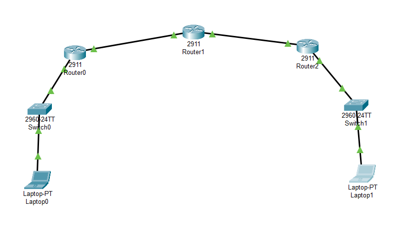

# 🖧 Cisco Packet Tracer Static Routing Network Configuration

This document provides configuration steps for a basic static routing network topology in Cisco Packet Tracer.

---


## 🔧 Network Components

- **Routers (Cisco 2911):** Router0, Router1, Router2
- **Switches (Cisco 2960-24TT):** Switch0, Switch1
- **End Devices:** Laptop0 (connected to Switch0), Laptop1 (connected to Switch1)

---

## 📶 Network Topology

```
Laptop0 ↔ Switch0 ↔ Router0 ↔ Router1 ↔ Router2 ↔ Switch1 ↔ Laptop1
```

---

## 📋 IP Addressing Scheme

| Device      | Interface       | IP Address     | Subnet Mask     |
|-------------|------------------|----------------|------------------|
| Laptop0     | -                | 192.168.1.10   | 255.255.255.0    |
| Router0     | G0/0             | 192.168.1.1    | 255.255.255.0    |
| Router0     | G0/1             | 10.0.0.1       | 255.255.255.0    |
| Router1     | G0/0             | 10.0.0.2       | 255.255.255.0    |
| Router1     | G0/1             | 10.0.1.1       | 255.255.255.0    |
| Router2     | G0/0             | 10.0.1.2       | 255.255.255.0    |
| Router2     | G0/1             | 192.168.2.1    | 255.255.255.0    |
| Laptop1     | -                | 192.168.2.10   | 255.255.255.0    |

---

## 🛠️ Configuration Steps

### ✅ Step 1: Configure Laptops

**Laptop0**
- IP Address: `192.168.1.10`
- Subnet Mask: `255.255.255.0`
- Default Gateway: `192.168.1.1`

**Laptop1**
- IP Address: `192.168.2.10`
- Subnet Mask: `255.255.255.0`
- Default Gateway: `192.168.2.1`

---

### ✅ Step 2: Configure Router0

```bash
enable
configure terminal
interface g0/0
ip address 192.168.1.1 255.255.255.0
no shutdown
exit
interface g0/1
ip address 10.0.0.1 255.255.255.0
no shutdown
exit
ip route 192.168.2.0 255.255.255.0 10.0.0.2
exit
```

---

### ✅ Step 3: Configure Router1

```bash
enable
configure terminal
interface g0/0
ip address 10.0.0.2 255.255.255.0
no shutdown
exit
interface g0/1
ip address 10.0.1.1 255.255.255.0
no shutdown
exit
ip route 192.168.1.0 255.255.255.0 10.0.0.1
ip route 192.168.2.0 255.255.255.0 10.0.1.2
exit
```

---

### ✅ Step 4: Configure Router2

```bash
enable
configure terminal
interface g0/0
ip address 10.0.1.2 255.255.255.0
no shutdown
exit
interface g0/1
ip address 192.168.2.1 255.255.255.0
no shutdown
exit
ip route 192.168.1.0 255.255.255.0 10.0.1.1
exit
```

---

## 🔁 Testing the Network

From **Laptop0**, ping **Laptop1**:
```bash
ping 192.168.2.10
```

You should receive replies indicating successful routing between the networks.
